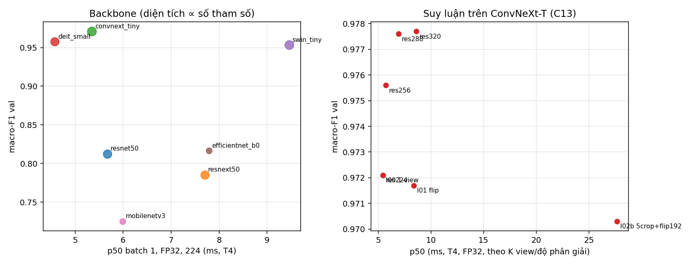

# Báo cáo Lab Day 2 — DeepWeeds: backbone, công thức huấn luyện, suy luận

Mọi số val trong báo cáo đến từ log chạy thật (`results.xlsx`, `logs/runs/<exp_id>/seed<k>/summary.json`). Mọi số test được `eval.py score` tính lại từ `predictions/` (`eval_out/`, `logs/grade.txt`).

## 1. Tóm tắt

- **Bài toán:** phân loại 9 lớp (8 loài cỏ dại + Negative) trên DeepWeeds, fold 0 chia sẵn (train 10.501 / val 3.501 / test 3.507 ảnh).
- **Đã làm:** 7 backbone (B01–B07); ablation trên ConvNeXt-T với 6 trục (C00–C13) và pilot trên ResNet-50 (T00–T12); suy luận gồm TTA lật, multi-crop, độ phân giải test, gộp prob/logit, temperature scaling, đo độ trễ; chung kết 3 seed cùng mốc 3 seed.
- **Cấu hình tốt nhất (chốt trên val):** ConvNeXt-T (`convnext_tiny.in12k_ft_in1k`), TrivialAugment + CutMix + CE có trọng số lớp, 12 epoch; suy luận 1 view ở **độ phân giải test 288** + temperature scaling (T khớp trên val). Không dùng TTA lật.
- **Kết quả test (mean ± std, 3 seed, toàn bộ 3.507 ảnh, test chạy một lần mỗi seed):**

| | Top-1 | Macro-F1 | ECE | Recall Chinee Apple | Recall Snake Weed |
|---|---|---|---|---|---|
| **F01 (tốt nhất)** | **0,9812 ± 0,0005** | **0,9774 ± 0,0006** | 0,0041 ± 0,0013 | 0,9617 ± 0,0068 | 0,9706 ± 0,0049 |
| Mốc C00 (nền + 1 view) | 0,9760 ± 0,0017 | 0,9692 ± 0,0024 | 0,0136 ± 0,0012 | 0,9469 ± 0,0234 | 0,9526 ± 0,0142 |

  Cải thiện macro-F1 so với mốc: **Δ = +0,0082**, lớn hơn std lớn nhất của hai nhóm (0,0024) nên vượt nhiễu. Độ trễ batch 1 của cấu hình chung kết (288, FP32, T4): p50 6,9 ms, p95 9,4 ms (mốc 224: p50 5,4 ms).
- **Kết luận chính:** (i) **backbone và khởi tạo** quyết định kết quả (ConvNeXt-T 0,971 so với ResNet-50 0,812 macro-F1 val; học từ đầu giảm 0,67); (ii) các yếu tố công thức (augmentation, loss, sampler, EMA) chỉ thay đổi ≤ 0,005 ở 1 seed, ở mức nhiễu; (iii) suy luận: tăng độ phân giải test lên 288 cho ≈ +0,005, lật và multi-crop không giúp, temperature scaling giảm ECE test từ 0,0345 xuống 0,0041.

## 2. Dữ liệu và thiết lập

**Dữ liệu.** `images.zip` nguyên bản Zenodo (MD5 `b7b30f96d466fba86016aa5a26606e0f`, 17.509 ảnh); nhãn và fold 0 nguyên bản từ GitHub của tác giả (không sửa, không lọc). Các kiểm tra bắt buộc đều qua (`dataset.check_split`): giao các cặp tập rỗng, hợp = 17.509, mọi file tồn tại, tỉ lệ 60,0 / 20,0 / 20,0%.

| Lớp | train | val | test | tổng | Table 1 bài báo |
|---|---|---|---|---|---|
| Chinee Apple | 675 | 225 | 226 | 1.126 | 1.125 |
| Lantana | 637 | 213 | 213 | 1.063 | 1.064 |
| Parkinsonia | 618 | 206 | 207 | 1.031 | 1.031 |
| Parthenium | 613 | 204 | 205 | 1.022 | 1.022 |
| Prickly Acacia | 637 | 212 | 213 | 1.062 | 1.062 |
| Rubber Vine | 605 | 202 | 202 | 1.009 | 1.009 |
| Siam Weed | 644 | 215 | 215 | 1.074 | 1.074 |
| Snake Weed | 609 | 203 | 204 | 1.016 | 1.016 |
| Negatives | 5.463 | 1.821 | 1.822 | 9.106 | 9.106 |

Số đếm lệch ±1 ở hai lớp so với bài báo (Chinee Apple 1.126 so với 1.125, Lantana 1.063 so với 1.064); tổng vẫn đúng 17.509. Negatives chiếm 52,0%, tỉ lệ lớp lớn/nhỏ ≈ 9,0, nên top-1 bị lớp này kéo cao và macro-F1 là chỉ số chính. Biểu đồ: `eda/class_dist.png`, ảnh mẫu `eda/samples.png`.

**Kiểm tra pipeline** (`eda/sanity.json`, `eda/aug_check.png`): loss ban đầu 2,195 (≈ ln 9 = 2,197); overfit 1 batch 16 ảnh về 2,1e-4; ảnh sau augmentation khớp nhãn.

**Công thức nền (mọi backbone như nhau):** init ImageNet + head mới 9 lớp, tinh chỉnh toàn bộ; train RandomResizedCrop 224 + lật ngang, val/test CenterCrop 224; AdamW, LR backbone 1e-4 / head 1e-3, weight decay 0,05 (không áp dụng cho norm/bias), warmup 1 epoch + cosine, CE, batch 64, 12 epoch, AMP, clip grad 1,0; chọn checkpoint theo macro-F1 val (hòa lấy epoch sớm).

**Phần cứng và phiên bản:** Kaggle Tesla T4; torch 2.11.0+cu128, timm 1.0.29, torchvision 0.26.0; Python 3.13. Tag trọng số timm ghi trong `config.json` của từng lần chạy. Seed 0 cho các bước sàng; seed 0, 1, 2 cho chung kết.

**Quy trình val/test.** Backbone, siêu tham số, tổ hợp công thức, view TTA, độ phân giải test và nhiệt độ T đều chọn **chỉ trên val**. Test chạy đúng một lần mỗi seed: chung kết F01 qua `experiments.finalize` (huấn luyện không ghi test), mốc C00 qua `save_test_predictions` ở lần huấn luyện cuối. Quyết định "dùng tổ hợp C13 và độ phân giải 288" do notebook tự đưa ra từ số val (`USE_COMBO`, `RES`), không từ test.

## 3. So sánh backbone (val, seed 0, công thức nền)

| exp_id | Backbone | Tag trọng số | Params (M) | GMAC | macro-F1 | top-1 | s/epoch | p50 b1 (ms) | p95 b1 (ms) |
|---|---|---|---|---|---|---|---|---|---|
| B01 | ResNet-50 | a1_in1k | 23,5 | 4,09 | 0,8125 | 0,8626 | 44,8 | 5,67 | 8,40 |
| B02 | ResNeXt-50 32x4d | a1h_in1k | 23,0 | 4,23 | 0,7853 | 0,8218 | 60,2 | 7,70 | 8,39 |
| **B03** | **ConvNeXt-T** | in12k_ft_in1k | 27,8 | 4,45 | **0,9710** | **0,9777** | 52,2 | 5,35 | 9,35 |
| B04 | DeiT-S | fb_in1k | 21,7 | 4,60 | 0,9576 | 0,9700 | 35,1 | 4,58 | 4,91 |
| B05 | Swin-T | ms_in1k | 27,5 | 4,49 | 0,9534 | 0,9640 | 66,9 | 9,46 | 12,77 |
| B06 | EfficientNet-B0 | ra_in1k | 4,0 | 0,38 | 0,8164 | 0,8638 | 29,1 | 7,79 | 8,41 |
| B07 | MobileNetV3-L | ra_in1k | 4,2 | 0,22 | 0,7250 | 0,7989 | 18,9 | 5,99 | 6,57 |

(s/epoch = thời gian train mỗi epoch trên T4. Độ trễ suy luận: batch 1, FP32, 224, T4, warmup 10 + 100 lần đo, đồng bộ CUDA, không gồm tiền xử lý, trọng số khởi tạo ngẫu nhiên vì độ trễ không phụ thuộc giá trị trọng số; `logs/latency_backbones.csv`, sheet `Backbones`. p95 ở batch 1 dao động giữa các lần chạy vài ms do chi phí khởi chạy kernel phía CPU: cùng ConvNeXt-T 224 cho p95 6,0 ms ở lần đo trước và 9,4 ms ở lần này, nên so sánh bằng p50. Độ trễ gần như không tương quan với GMAC ở batch 1: DeiT-S nhanh nhất, Swin-T chậm nhất, MobileNetV3 (0,2 GMAC) không nhanh hơn ConvNeXt-T (4,5 GMAC), vì ở batch 1 chi phí do số lớp/kernel chứ không do FLOPs. Biểu đồ đánh đổi: `figures/tradeoff_acc_latency.png`.)

**Nhận xét.** Chênh lệch giữa họ LayerNorm (ConvNeXt, DeiT, Swin ≥ 0,95) và họ BatchNorm (≤ 0,82) rất lớn, vượt xa nhiễu. Đường cong B01/B07 (`curves/`) cho thấy các mạng BatchNorm chưa hội tụ trong 12 epoch: train loss ResNet-50 còn 0,38 và val loss giảm đều, không quá khớp. Vì vậy đây là hiệu ứng của "công thức nền cố định" hơn là kết luận về kiến trúc: các trọng số `a1_in1k`/`a1h_in1k` được tạo bằng công thức khác (BCE, LAMB, LR lớn) và có thể cần LR lớn hơn. Công thức không được dò riêng cho từng backbone. ConvNeXt-T còn được tiền huấn luyện thêm trên ImageNet-12k, một lợi thế khi so với ResNet-50. Thứ hạng ở đây không trùng thứ hạng ImageNet của slide (ResNet-50 và ConvNeXt-T cách nhau nhiều hơn, EfficientNet-B0 ngang ResNet-50). FLOPs không dự đoán thời gian train: DeiT-S (4,6 GMAC) nhanh hơn ResNet-50 (4,1 GMAC), Swin-T (4,5 GMAC) chậm nhất.

**Chọn backbone:** ConvNeXt-T, vì macro-F1 val cao nhất với khoảng cách vượt nhiễu và độ trễ batch 1 thấp (p50 5,35 ms, chỉ DeiT-S 4,58 ms nhanh hơn). ConvNeXt-T nằm trên biên Pareto độ chính xác - độ trễ của biểu đồ trên: không backbone nào vừa chính xác hơn vừa nhanh hơn. DeiT-S là lựa chọn nếu cần huấn luyện nhanh hơn (35 so với 52 giây/epoch) với macro-F1 thấp hơn 0,013.

**Thứ tự làm việc (nêu rõ).** Phase A ban đầu chạy ablation T00–T12 trên **ResNet-50**, backbone tôi đã chốt *trước khi* có số B (để chạy tự động). Sau khi thấy B03 vượt xa, tôi chạy lại ablation trên ConvNeXt-T (C-series, cùng thiết kế). T-series được giữ làm **pilot** (sheet `Training_pilot_resnet50`). Lần đầu T09 lỗi dtype (logits Half, trọng số lớp Float); đã sửa ở `train.py` và chạy lại.

## 4. Công thức huấn luyện

### 4.1 Ablation chính: ConvNeXt-T (val, seed 0)

Mỗi dòng chỉ khác nền C00 một yếu tố. Cách chọn tổ hợp là tham lam theo trục: gom các yếu tố có Δ > 0 (C04, C05, C09) rồi kiểm tra tổ hợp trên val (C13). Chênh lệch dưới ≈ 0,005 coi là **không phân biệt được**, vì mới có 1 seed (std của nền ở chung kết là 0,0024).

| exp_id | Trục | Khác nền | macro-F1 val | Δ so với C00 |
|---|---|---|---|---|
| C00 | nền | – | 0,9689 | – |
| C01 | A khởi tạo | backbone đóng băng, chỉ train head | 0,8563 | −0,1126 |
| C02 | A khởi tạo | học từ đầu | 0,3013 | −0,6676 |
| C03 | B augmentation | + ColorJitter | 0,9655 | −0,0034 |
| C04 | B augmentation | TrivialAugment | 0,9723 | +0,0034 |
| C05 | B augmentation | CutMix | 0,9731 | +0,0042 |
| C06 | B augmentation | Mixup | 0,9654 | −0,0035 |
| C07 | C loss | label smoothing 0,1 | 0,9685 | −0,0004 |
| C08 | C loss | focal γ=2 | 0,9687 | −0,0002 |
| C09 | C loss | CE trọng số 1/n_lớp | 0,9717 | +0,0028 |
| C10 | D sampler | cân bằng lớp | 0,9650 | −0,0039 |
| C11 | F EMA | EMA 0,995 | 0,9692 | +0,0003 |
| C12 | E LR | LR ×2 (2e-4 / 2e-3) | 0,9636 | −0,0053 |
| **C13** | kết hợp | TrivialAugment + CutMix + CE trọng số | **0,9721** | **+0,0032** |

**Phân tích.**
- **Rõ ràng, vượt nhiễu:** khởi tạo. Đóng băng backbone mất 0,11; học từ đầu mất 0,67 (ConvNeXt từ đầu trên ~10k ảnh gần như không học, đúng kỳ vọng về thiên kiến quy nạp yếu và ít dữ liệu).
- **Không phân biệt được:** mọi yếu tố còn lại (|Δ| ≤ 0,005) ở mức nhiễu của 1 seed. Các yếu tố có Δ > 0 (CutMix, TrivialAugment, CE trọng số) cộng lại chỉ cho +0,0032, **nhỏ hơn tổng các Δ riêng lẻ** (+0,0104): hiệu ứng triệt tiêu, hoặc vốn chỉ là nhiễu. Tổ hợp vẫn được dùng vì val cao hơn C00, nhưng không thể khẳng định lợi ích riêng của nó (xem mục 6).
- **Focal γ=2 và label smoothing** không đổi (≈ 0): lớp Negative áp đảo nhưng mô hình đã cân bằng tốt nhờ nền mạnh. Lật dọc không được thử (chưa kiểm chứng là hợp lệ với ảnh cỏ dại).
- **EMA** không giúp trong lịch 12 epoch ngắn (~1.970 bước) với decay 0,995.
- Quan sát đường cong F01 (`curves/F01_seed0.png`): train loss (0,56) cao hơn val loss (0,10) vì train dùng ảnh bị trộn CutMix và TrivialAugment, nên loss train không so được với val.

### 4.2 Pilot ResNet-50 (val, seed 0)

| exp_id | Khác nền | macro-F1 | Δ |
|---|---|---|---|
| T00 | nền | 0,8125 | – |
| T01 / T02 | đóng băng / từ đầu | 0,6175 / 0,4847 | −0,195 / −0,328 |
| T03 / T04 | ColorJitter / TrivialAugment | 0,8050 / 0,8147 | −0,007 / +0,002 |
| T05 / T06 | CutMix / Mixup | 0,7824 / 0,7825 | −0,030 / −0,030 |
| T07 / T08 / T09 | label smoothing / focal / CE trọng số | 0,8123 / 0,8127 / 0,8021 | −0,000 / +0,000 / −0,010 |
| T10 | sampler cân bằng | 0,7936 | −0,019 |
| T11 / T12 | EMA / LR đầu thấp | 0,8091 / 0,7903 | −0,003 / −0,022 |

Trên mạng BatchNorm còn đang học dở, augmentation mạnh (CutMix, Mixup) làm hại (−0,03), ngược với ConvNeXt (+0,004). Hiệu ứng của một kỹ thuật phụ thuộc vào backbone và vào việc mô hình đã hội tụ hay chưa.

## 5. Suy luận và độ trễ

Mô hình C13, đánh giá trên **val** (seed 0), `inference.csv`:

| exp_id | Phương pháp | K view | macro-F1 | top-1 | ECE |
|---|---|---|---|---|---|
| I00 | 1 view (224) | 1 | 0,9721 | 0,9789 | 0,0129 |
| I01 | TTA lật (prob / logit) | 2 | 0,9717 / 0,9715 | 0,9786 | 0,0137 / 0,0122 |
| I02 | 5 crop 192 | 5 | 0,9695 | 0,9763 | 0,0096 |
| I02b | 5 crop + lật | 10 | 0,9703 | 0,9766 | 0,0081 |
| I04 | độ phân giải test 256 | 1 | 0,9756 | 0,9817 | 0,0197 |
| I04 | 288 | 1 | 0,9776 | 0,9826 | 0,0299 |
| I04 | 320 | 1 | 0,9777 | 0,9820 | 0,0381 |
| I07 | temperature scaling T=0,875 | 1 | 0,9721 | 0,9789 | 0,0129 → 0,0054 |

- **Gộp prob và logit:** khác nhau dưới 0,0003, không phân biệt được.
- **TTA lật và multi-crop không giúp** (chênh lệch trong ±0,003) mà tốn K lần chi phí; multi-crop 192 còn kém hơn vì mô hình huấn luyện ở 224. Slide cảnh báo TTA không phải "miễn phí"; ở đây nó không có lợi cả về độ chính xác.
- **Tăng độ phân giải test** (FixRes, slide trang 68) cho ≈ +0,005 macro-F1 không đổi tham số, nhưng FLOPs tăng ≈ (288/224)² = 1,65× và **ECE tăng** (0,013 → 0,030): mô hình tự tin hơn. Độ phân giải 288 được chọn là mức nhỏ nhất trong 0,001 của mức tốt nhất (320 chỉ hơn 0,0001).
- **Temperature scaling:** T khớp trên val; ECE val giảm 0,0129 → 0,0054; trên test (độ phân giải 288) ECE giảm 0,0345 → 0,0041, accuracy không đổi. Với tăng độ phân giải thì hiệu chuẩn thực sự cần thiết.
- **Chưa thử:** ensemble nhiều mô hình, model soup, EMA ở suy luận, ONNX.

**Độ trễ** (`logs/latency.csv`, T4, ConvNeXt-T 224, warmup 10, `cuda.synchronize`, 100 lần đo, `inference_mode`, không gồm tiền xử lý; sheet `Latency`):

| dtype | batch | p50 (ms) | p95 (ms) | p99 (ms) | ảnh/giây |
|---|---|---|---|---|---|
| FP32 | 1 | 5,74 | 6,00 | 6,08 | 174 |
| AMP | 1 | 7,80 | 8,47 | 8,99 | 128 |
| FP16 | 1 | 5,77 | 6,17 | 6,31 | 173 |
| FP32 | 32 | 136,1 | 138,4 | 139,8 | 235 |
| AMP | 32 | 50,3 | 51,3 | 51,6 | 636 |
| FP16 | 32 | 40,4 | 41,1 | 41,3 | 792 |
| TTA lật K=2 (batch 2, FP32) | 2 | 9,79 | 10,93 | 14,82 | – |

- Ở batch 1, **AMP chậm hơn FP32** (7,8 so với 5,7 ms) vì chi phí chuyển kiểu; FP16 thuần ngang FP32. Ở batch 32, AMP/FP16 nhanh hơn FP32 gấp 2,7–3,4 lần. Đúng với cảnh báo "đo trên máy của bạn" của slide.
- TTA lật K=2 tốn 1,7× (9,8 so với 5,8 ms), ít hơn 2× nhờ gộp batch, nhưng không mang lại độ chính xác.
- **Gộp BN** không áp dụng cho ConvNeXt (dùng LayerNorm): bản gộp trả về nguyên mô hình, độ trễ không đổi.
- **Độ trễ và chi phí của từng phương pháp suy luận** (lần đo bổ sung, T4, FP32, batch 1 ảnh gốc, K view gộp thành batch K; `logs/latency_inference.csv`, sheet `Inference`):

| Phương pháp | macro-F1 val | p50 (ms) | p95 (ms) | p99 (ms) | chi phí so với I00 |
|---|---|---|---|---|---|
| I00 1 view 224 | 0,9721 | 5,43 | 9,36 | 9,39 | 1,00× |
| I01 lật K=2 | 0,9717 | 8,38 | 11,38 | 11,40 | 1,54× |
| I02b 5 crop + lật 192 (K=10) | 0,9703 | 27,65 | 28,33 | 28,38 | 5,09× |
| I04 res256 | 0,9756 | 5,73 | 10,40 | 10,43 | 1,05× |
| **I04 res288 (cấu hình F01)** | 0,9776 | 6,91 | 9,37 | 9,40 | 1,27× |
| I04 res320 | 0,9777 | 8,59 | 14,90 | 14,93 | 1,58× |
| temperature scaling | – | + không đáng kể | | | ≈ 1,00× |

  I02 (5 crop, K=5) chưa đo độ trễ vì F1 không hơn I00. Nhận xét: độ phân giải 288 cho +0,0055 macro-F1 chỉ với 1,27× chi phí (p50 +1,5 ms), còn TTA lật tốn 1,54× và 5 crop + lật tốn 5,1× mà không tăng F1; ở biểu đồ đánh đổi (`figures/tradeoff_acc_latency.png`, ô phải) ngoài I00 (nhanh nhất) chỉ các điểm res256/288/320 nằm trên biên Pareto; lật và multi-crop bị chi phối. FP16 thuần ở batch 1: 224 → 5,42 ms, 288 → 5,59 ms (p50), tức ở batch 1 GPU chưa bão hòa nên tăng độ phân giải gần như miễn phí.
- **Số đưa vào `eval.py grade` (I5)** là p95 của chính cấu hình chung kết (288, FP32, batch 1) = 9,4 ms, dưới ngân sách 100 ms; điểm I5 vẫn 2/2.
- **Khuyến nghị:** *ngoại tuyến* dùng cấu hình chung kết (độ phân giải 288 + temperature scaling); *thời gian thực* dùng 1 view; nếu cần ngắn nhất thì 224 (p50 5,4 ms, macro-F1 val 0,972), còn 288 chỉ chậm hơn 1,5 ms (p50 6,9 ms, 0,978) nên cũng dùng được; không dùng TTA và AMP ở batch 1.

## 6. Cấu hình tốt nhất và kết quả chung kết

**F01 = ConvNeXt-T (in12k_ft_in1k) + TrivialAugment + CutMix (α=1) + CE trọng số 1/n_lớp + 12 epoch, test ở 288 và temperature scaling.** Mốc C00 = công thức nền + 1 view ở 224. Cùng 3 seed (0, 1, 2), mỗi seed test chạy một lần. Số trong bảng là mean ± std (ddof=1); trùng với `eval.py score`.

| | macro-F1 val | macro-F1 test | top-1 test | balanced acc | ECE test |
|---|---|---|---|---|---|
| F01 | 0,9776 ± 0,0007 | **0,9774 ± 0,0006** | **0,9812 ± 0,0005** | 0,9794 ± 0,0023 | 0,0041 ± 0,0013 |
| C00 | 0,9671 ± 0,0016 | 0,9692 ± 0,0024 | 0,9760 ± 0,0017 | 0,9721 ± 0,0018 | 0,0136 ± 0,0012 |

Từng seed F01: macro-F1 test 0,9771 / 0,9782 / 0,9770; top-1 0,9809 / 0,9818 / 0,9809. Chênh lệch macro-F1 giữa val và test của F01 là 0,0002 (≤ 0,02), nên không có dấu hiệu chọn cấu hình bằng test.

**So với mốc:** Δ macro-F1 = +0,0082 (> std lớn nhất 0,0024, nhưng < 0,01). Δ này **gộp ba thay đổi**: công thức C13, độ phân giải 288 và temperature scaling. Trên val (seed 0) chúng đóng góp lần lượt ≈ +0,003, +0,0055 và 0; ở test chưa tách riêng từng phần được vì ngân sách seed. Trong từng phần, riêng C13 (+0,003) không vượt nhiễu của 1 seed.

**Hai lớp khó** (recall test, mean ± std): Chinee Apple **0,9617 ± 0,0068** (mốc C00: 0,9469 ± 0,0234; bài báo ResNet-50: 0,885), Snake Weed **0,9706 ± 0,0049** (mốc: 0,9526 ± 0,0142; bài báo: 0,888). Cải thiện ở Chinee Apple (+0,015) nhỏ hơn std của mốc (0,023), nên chưa kết luận chắc; std của F01 nhỏ hơn hẳn (suy luận ổn định hơn giữa các seed).

**F1 theo lớp** (F01, `eval_out/F01_per_class.csv`): thấp nhất là Prickly Acacia 0,950 (precision 0,925), kế đó Chinee Apple 0,964 và Snake Weed 0,970; cao nhất Siam Weed 0,993. Tất cả lớp ≥ 0,949.

### Phân tích lỗi (`figures/confusion_F01.png`, `figures/errors_F01.png`)

Ma trận nhầm lẫn tổng 3 seed (chia 3 để ra trung bình mỗi seed):
- **Lỗi lớn nhất không phải cặp Chinee ↔ Snake mà là Negative → loài cỏ:** Negative → Prickly Acacia 49 (≈ 16 ảnh/seed, 0,9% của 1.822), Negative → Chinee Apple 12, Negative → Rubber Vine 9. Điều này làm precision của Prickly Acacia thấp (0,925).
- **Loài → Negative (bỏ sót):** Rubber Vine 15, Chinee Apple 15, Snake Weed 13 (tổng 3 seed).
- **Chinee Apple → Snake Weed: 10 (≈ 3,3/seed, 1,5%)**; **Snake Weed → Chinee Apple: 5 (0,8%)**. Thấp hơn nhiều so với bài báo (3,4% và 4,1%) nhưng vẫn là cặp nhầm lẫn giữa hai loài đáng kể nhất; Parthenium → Parkinsonia 8 và Prickly Acacia → Parkinsonia 6 là các cặp loài-loài còn lại.
- **Mức nhất quán:** 39 ảnh (1,1%) bị sai ở cả 3 seed, 62 ảnh sai ở ≥ 2 seed. Lỗi lặp lại giữa các seed cho thấy đó là ảnh khó hoặc nhãn mơ hồ, không phải nhiễu huấn luyện.
- **Xem ảnh sai (12 ảnh):** phần lớn là ảnh mặt đất có vật thể rất nhỏ hoặc bị che, bóng đổ mạnh, ánh sáng chói, thực vật thưa. Ảnh Negative bị đoán là Prickly Acacia thường có cành nhỏ mảnh trên nền đất, hình dạng gần với lá kép của Prickly Acacia; cặp Chinee ↔ Snake sai ở ảnh bị bóng che gần hết. **Giả thuyết:** (a) cây mục tiêu chiếm diện tích nhỏ nên RandomResizedCrop (scale mặc định 0,08–1) đôi khi cắt mất đối tượng lúc train; (b) lớp Negative rất đa dạng (đất, rác, cây khác) nên ranh giới với các loài có hoa/lá nhỏ mờ; (c) ánh sáng và bóng đổ khác nhau theo giờ chụp. Chưa kiểm chứng bằng thí nghiệm riêng (ví dụ giảm `scale` hoặc Grad-CAM).

## 7. Kết luận và khuyến nghị

- **Cấu hình tốt nhất:** F01 (mục 6): macro-F1 test 0,9774 ± 0,0006, top-1 0,9812 ± 0,0005, tốt hơn mốc +0,0082 macro-F1, vượt nhiễu. Về mặt tham chiếu, top-1 này cao hơn số của bài báo (ResNet-50 95,7%), nhưng **không so sánh trực tiếp được** vì bài báo đo weighted accuracy, huấn luyện khác và tôi dùng trọng số ConvNeXt tiền huấn luyện trên ImageNet-12k.
- **Yếu tố đóng góp nhiều nhất:** backbone/khởi tạo (≥ 0,15 macro-F1 val) ≫ suy luận (độ phân giải test ≈ 0,005) ≳ công thức huấn luyện (≤ 0,005, không phân biệt được với nhiễu). Temperature scaling không đổi độ chính xác nhưng giảm ECE test 8 lần (0,0345 → 0,0041).
- **Triển khai trên robot (30–100 ms/khung):** 1 view ở 224, FP32 hoặc FP16, batch 1, p95 ≈ 6 ms trên T4, kèm temperature scaling; nếu cần thêm độ chính xác có thể dùng 288 (ước ≈ 10 ms, cần đo) và chấp nhận chi phí FLOPs ×1,65. Không dùng AMP ở batch 1, không dùng TTA/multi-crop.
- **Việc tiếp theo nếu có thêm thời gian:** dò LR riêng cho họ BatchNorm để so sánh backbone công bằng hơn; ≥ 3 seed cho ablation để phân biệt các yếu tố nhỏ; tách riêng đóng góp của C13, độ phân giải và hiệu chuẩn ở test; ensemble nhiều seed; fold 1–4; đánh giá với dữ liệu khác địa điểm hoặc mùa.

## 8. Hạn chế và trung thực

- **Một fold, chia ngẫu nhiên không theo địa điểm hay thời gian.** Tên file cho thấy ảnh chụp liên tiếp theo thời gian (nhiều ảnh gần trùng nhau cùng một chỗ), nên ảnh test có thể rất giống ảnh train: điểm test **có thể lạc quan** so với khi gặp địa điểm hoặc mùa mới, và T khớp trên val có thể kém tin cậy khi lệch phân phối. Chưa có thí nghiệm lệch miền để định lượng.
- **Các thí nghiệm sàng chỉ 1 seed:** chênh lệch ≤ 0,005 không kết luận được. Chỉ chung kết có 3 seed (n=3 làm std ước lượng kém chính xác).
- **So sánh backbone dùng một công thức nền duy nhất** (LR 1e-4/1e-3, 12 epoch): bất lợi cho các mạng BatchNorm với trọng số huấn luyện bằng công thức khác; xếp hạng có thể đổi nếu dò LR riêng. ConvNeXt-T có lợi thế tiền huấn luyện ImageNet-12k.
- **Thứ tự chọn backbone cho ablation:** pilot ResNet-50 chọn trước khi có số B; ablation chính chạy trên ConvNeXt-T sau khi thấy B (chỉ dùng val).
- **Δ chung kết so với mốc gộp ba thay đổi** (công thức, độ phân giải, hiệu chuẩn) nên không quy riêng cho yếu tố nào.
- **Độ trễ:** p95 batch 1 dao động vài ms giữa các lần chạy (CPU launch jitter của máy chia sẻ trên Kaggle), nên báo cáo p50 là chính; độ trễ I02 (5 crop, K=5) chưa đo; độ trễ đo bằng trọng số ngẫu nhiên, không kèm tiền xử lý/đọc ảnh. Không ensemble, soup, ONNX, hay các điểm thưởng.
- **Ngân sách:** 12 epoch (bài báo ~100 epoch, augmentation mạnh hơn), batch 64, 1 GPU T4. Tổng ≈ 8 giờ GPU trên Kaggle (A ≈ 3,2 giờ, C ≈ 3 giờ, B ≈ 2 giờ). Lần chạy B đầu lỗi ở đoạn chọn view (lỗi pandas, đã sửa) và được chạy lại; lần đó chưa chạm test.
- Tái lập chỉ gần đúng (cuDNN không hoàn toàn deterministic).
- Các số của bài báo (95,7%, 95,1%, 88,5%, 88,8%) là **trích dẫn**, không phải kết quả của tôi.

## Phụ lục — danh sách exp_id

B01–B07 (backbone), C00–C13 (ablation ConvNeXt-T; C14 không phát sinh vì tổ hợp được chấp nhận), T00–T12 (pilot ResNet-50), I00–I07 (suy luận), F01 (chung kết, seed 0–2), C00 seed 0–2 (mốc). Cấu hình đầy đủ: `logs/runs/<exp_id>/seed<k>/config.json`; biểu đồ: `curves/<exp_id>_seed<k>.png`; dự đoán: `predictions/`. Notebook: https://www.kaggle.com/code/ashuraotsuki/deepweeds-a , `deepweeds-c`, `deepweeds-b`.
